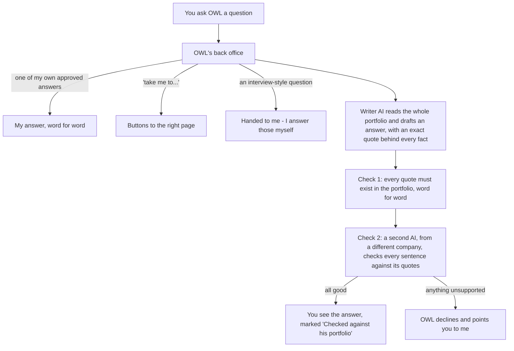

# Gaurav Joshi - portfolio

**Live site: https://gsj24983.github.io/**

Product and transformation leader, 18+ years. This repo holds my portfolio site, and the chat widget for **OWL**, the AI assistant that answers visitors' questions about my work.

*Zero to One | Abstract to Real | Chaos to Alignment*

---

## The site

One site, four ways in. The landing page asks why you're here and takes you to the version of the story that fits.

| Page | What's on it |
|---|---|
| [Landing](https://gsj24983.github.io/) | OWL, plus four doors: hire full-time, consulting or fractional work, training and coaching, or just browsing |
| [Overview](https://gsj24983.github.io/overview.html) | The pitch for each audience, in three tabs |
| [Who I am](https://gsj24983.github.io/who-am-i.html) | Results with numbers, AI work, career journey, skill map |
| [How I think](https://gsj24983.github.io/how-i-think.html) | Three cases, my frameworks (Swanubhava™, PKVit, the AI Trustworthiness Matrix) and 28 articles |
| [In their words](https://gsj24983.github.io/in-their-words.html) | 16 LinkedIn recommendations, word for word |
| [Get in touch](https://gsj24983.github.io/contact.html) | How engagements work, and downloads (résumés, professional brief, case decks) |

Plain HTML, CSS and a little JavaScript, hosted on GitHub Pages. No framework, no tracking.

---

## OWL - an assistant that would rather say 'I don't know'

OWL sits on the landing page and behind the 'Ask about Gaurav' button on every page. Ask it about my roles, results, availability, training offer or case studies, and it answers **only from this portfolio**. If something isn't here, it says so instead of guessing.

### The idea in one picture

Think of a receptionist who has read my whole portfolio, and a second person who checks every sentence the receptionist says before you hear it.

### How it stays honest

- **It reads everything, every time.** The whole portfolio (site pages, every PDF page, my own facts and approved answers) goes into every question. There's no search step that could miss the one paragraph that mattered.
- **Every fact carries a quote.** The writer must back each statement with an exact quote from the portfolio, and plain code confirms each quote is really there. Words and numbers must match exactly.
- **A second opinion from a different company.** One company's AI writes; another company's AI checks. A model checking itself shares its own blind spots.
- **It fails closed.** If either check fails twice, the answer is blocked, not softened. A blocked answer costs nothing; a wrong one would undermine the whole point.
- **My words where it matters.** I reviewed and approved 120+ answers to the questions visitors ask most. OWL serves those word for word.
- **It knows what isn't its to answer.** Interview-style questions ('what would your first 90 days look like?'), salary and fees, and specific commitments come back to me, in wording I chose.
- **Third person, always.** OWL talks about me ('Gaurav led...'), never as me.
- **Nothing unchecked in its voice.** Every line OWL shows is either checked, one of my approved answers, or fixed wording I wrote (limits, handoffs, 'could you say more?'). When a reworded question is matched to one of my approved answers, a second model first confirms that answer really covers the whole question.

### How we know it works

Before going live, OWL went through a 132-question accuracy test: trick questions ('When did he work at Google?', 'He led 50 engineers, right?'), prompt-injection attempts, handoffs, interview questions, the same question asked in different words, and navigation requests. An independent auditor AI, with the full portfolio in hand, graded every answer.

**Final result: 0 unsupported answers, every decline and handoff correct, 98% of answerable questions answered with the key fact.**

After launch I ran OWL through my own [AI Trustworthiness Matrix](https://gsj24983.github.io/how-i-think.html#fw-atm), which rates reliability, safety, security, privacy, transparency and accountability. It flagged gaps, including three places where OWL's promises ran ahead of the code. I fixed those, and the other urgent ones, the same day. That's the point of the framework: audit your own claims before someone else does.

### Built with

- **Front end:** `ask.js` in this repo, a small dependency-free widget
- **Back end:** a Cloudflare Worker, which keeps the API keys off the website
- **Writer:** Google Gemini
- **Checker:** Anthropic Claude
- **Log:** a Google Sheet, for questions, feedback and follow-up requests

The back end, test suite and content pipeline live in a private workspace. This repo holds the site and the widget.

OWL was designed and product-owned by me, and built with Claude as my engineering partner. Choosing where AI earns its place, and where it has to be checked, is the kind of AI product work I do.

---

## Privacy

Questions asked to OWL are logged to improve its answers, with no names - unless a visitor shares their email or opens a personal invite link, which carries the name I gave it. A random id kept in the browser counts the day's questions. Question logs are deleted after 12 months. The site itself has no analytics or tracking.

---

## Contact

- Email: kavee.gauravjoshi@gmail.com
- LinkedIn: [linkedin.com/in/gsjoshi](https://www.linkedin.com/in/gsjoshi)

© 2026 Gaurav Joshi. All rights reserved. Swanubhava™ is a trademark of Gaurav Joshi. Content on this site may not be reproduced without permission.
